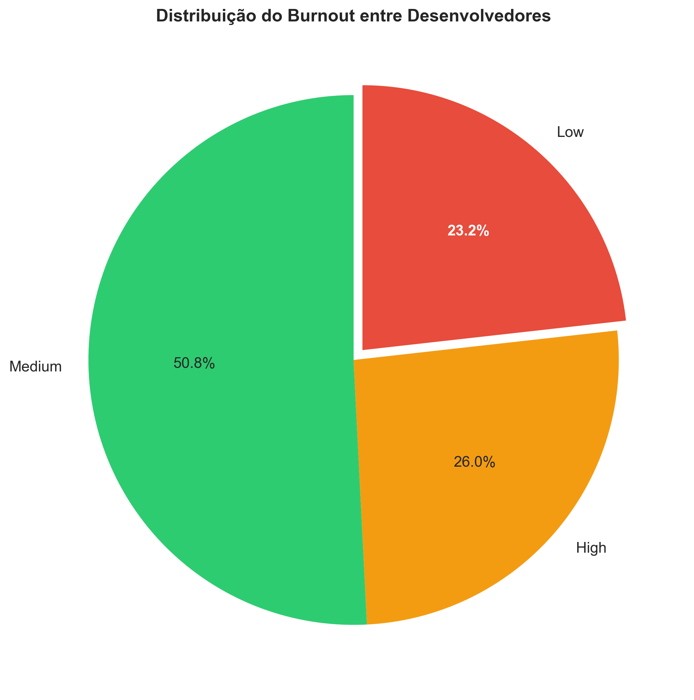
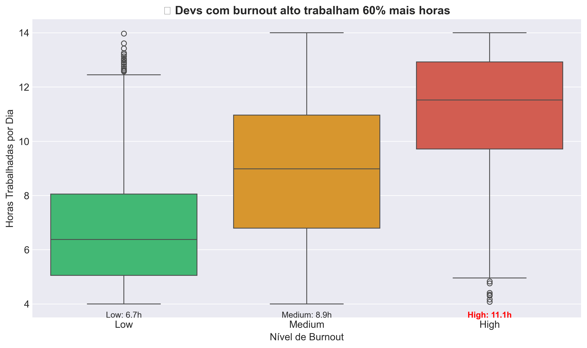
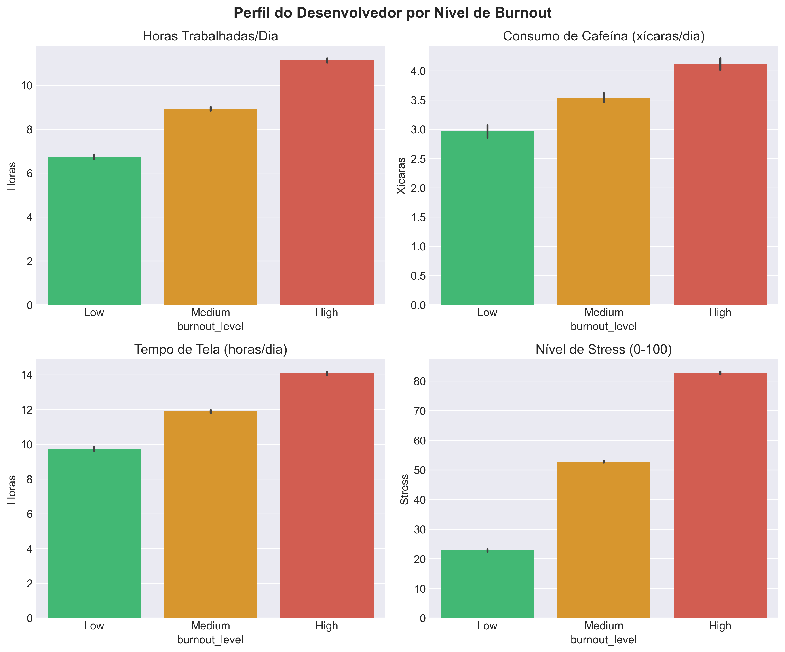
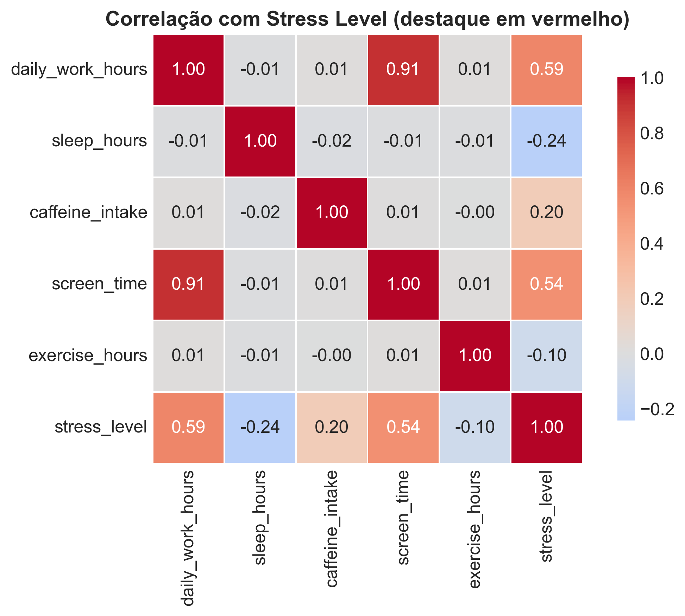

# 🔥 Análise de Burnout em Desenvolvedores

[](https://www.python.org/)
[](https://pandas.pydata.org/)
[](https://seaborn.pydata.org/)
[](https://opensource.org/licenses/MIT)

## 📌 Sobre o Projeto

Este projeto analisa dados de **6.860 desenvolvedores** para identificar os principais fatores associados ao burnout. A análise revela padrões surpreendentes sobre jornadas de trabalho, hábitos e produtividade.

> **Principal descoberta:** Desenvolvedores com burnout alto trabalham **60% mais horas** que o grupo saudável - e idade/experiência não protegem contra o problema.

## 🎯 Principais Insights

| # | Insight | Dado |
|---|---------|------|
| 1 | **77%** dos desenvolvedores têm burnout médio ou alto | 50.8% Medium + 26.0% High |
| 2 | Burnout alto = trabalhar **12.8h/dia** (vs 8h no grupo Low) | +60% de carga horária |
| 3 | Maiores correlações com stress: | horas (0.60) > tela (0.54) > cafeína (0.20) |
| 4 | Devs com burnout alto bebem **+2 xícaras de café** | 6 vs 4 xícaras/dia |
| 5 | Tempo de tela dispara no burnout alto | 18h vs 14h (grupo saudável) |

## 📊 Visualizações

### 1. Distribuição do Burnout

*Mais da metade dos devs está em nível médio de burnout.*

### 2. Horas Trabalhadas x Burnout (Insight Principal)

*A diferença é brutal: 12.8h/dia no grupo High vs 6.7h no Low.*

### 3. Perfil Completo por Nível de Burnout

*Cafeína, tempo de tela e stress acompanham a mesma tendência.*

### 4. Matriz de Correlação

*Horas trabalhadas e tempo de tela são os fatores mais correlacionados com stress.*

## 🛠️ Tecnologias Utilizadas

- **Python 3.12** - Linguagem principal
- **Pandas** - Manipulação e limpeza dos dados
- **NumPy** - Operações numéricas
- **Matplotlib & Seaborn** - Visualizações
- **Jupyter Notebook** - Análise exploratória

## 📁 Estrutura do Projeto
developer-burnout-analysis/
│
├── data/
│ ├── developer_burnout_dataset_7000.csv
│ └── dataset_limpo.csv
│
├── images/
│ ├── grafico_1_horas_trabalhadas.png
│ ├── grafico_2_comparacao_completa.png
│ ├── grafico_3_correlacoes.png
│ └── grafico_4_distribuicao_burnout.png
│
├── cleaning_data.py
├── graphics.py
├── requirements.txt
└── README.md


## 🚀 Como Reproduzir

```bash
git clone https://github.com/cavalcanti30/developer-burnout-analysis.git
cd developer-burnout-analysis
pip install -r requirements.txt
python cleaning_data.py
python graphics.py
```

## 💡 Recomendações
- Limitar jornada a 10h/dia
- Alertar quando tela > 14h
- Atenção com cafeína > 4 xícaras

## 📫 Contato

[](https://www.linkedin.com/in/ricardo-rcaj)
